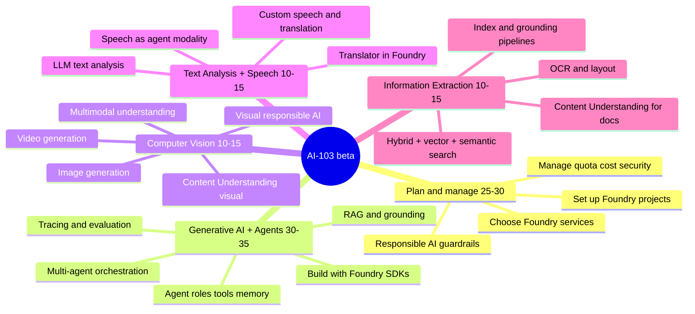
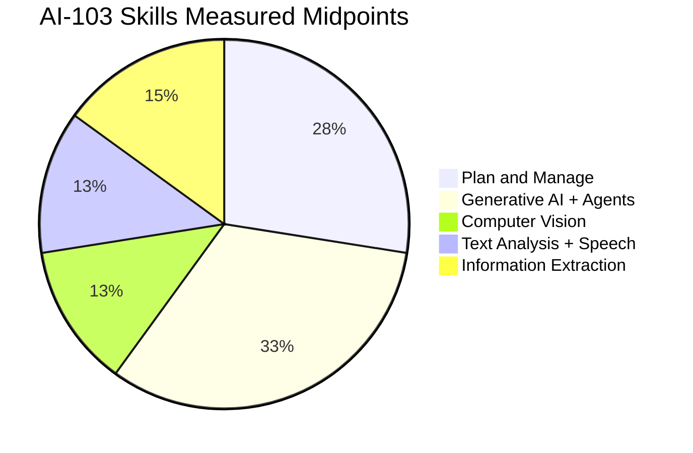
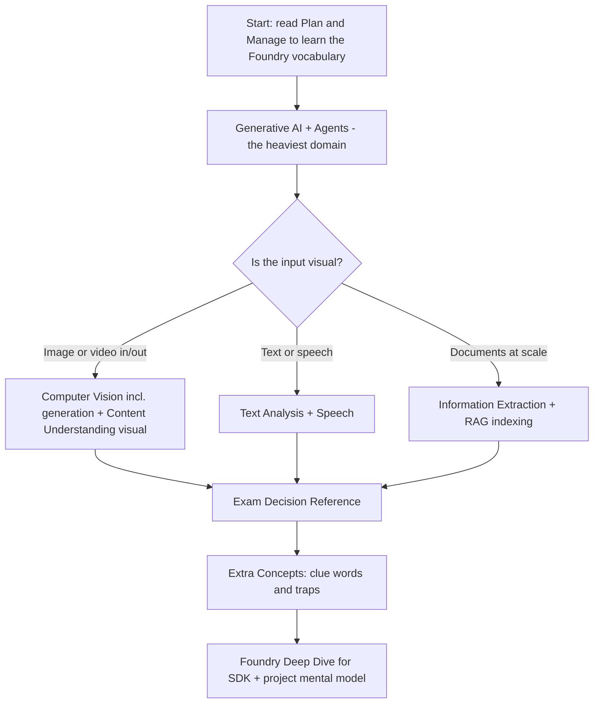

# AI-103 Visual Study Guide

> **Developing AI Apps and Agents on Azure** — Microsoft Certified: Azure AI Apps and Agents Developer Associate (beta)
>
> Aligned to the official [AI-103 study guide](https://learn.microsoft.com/credentials/certifications/resources/study-guides/ai-103) (skills measured as of **April 16, 2026**) and the [exam page](https://learn.microsoft.com/credentials/certifications/exams/ai-103/). Pure concept layer — visual notes, decision trees, and original summaries that map exam wording to the right Microsoft Foundry / Azure AI capability. No exam questions are reproduced.

AI-103 is the **natural evolution of AI-102**: gen-AI and agents are merged into one heavy domain, computer vision picks up **image and video generation**, and the entire exam is recentered on **Microsoft Foundry, Foundry Tools, Foundry SDKs, and Foundry Agent Service** with a strong push toward **keyless auth and managed identity**.

## Skill weighting (official)

| Domain | Weight | Page |
| --- | --- | --- |
| Plan and manage an Azure AI solution | **25–30%** | [01 Plan and Manage](01-plan-manage-ai-solution.md) |
| Implement generative AI and agentic solutions | **30–35%** | [02 Generative AI + Agents](02-generative-ai-and-agents.md) |
| Implement computer vision solutions | **10–15%** | [03 Computer Vision](03-computer-vision.md) |
| Implement text analysis solutions | **10–15%** | [04 Text Analysis + Speech](04-text-analysis-speech.md) |
| Implement information extraction solutions | **10–15%** | [05 Information Extraction](05-information-extraction.md) |

## Pages

| Page | Use it for |
| --- | --- |
| [Plan and Manage](01-plan-manage-ai-solution.md) | Service selection, Foundry projects, deployment, quota, security, monitoring, responsible AI. |
| [Generative AI + Agents](02-generative-ai-and-agents.md) | Foundry SDKs, RAG, agent roles, tools, memory, multi-agent orchestration, evaluators, tracing. |
| [Computer Vision](03-computer-vision.md) | Image **generation**, video **generation**, inpainting, multimodal Q&A, Content Understanding visual, accessibility, visual safety. |
| [Text Analysis + Speech](04-text-analysis-speech.md) | LLM-driven extraction, sentiment, summarization, Translator in Foundry Tools, speech-to-text, text-to-speech, agent voice modality. |
| [Information Extraction](05-information-extraction.md) | Indexing, hybrid + vector + semantic search, enrichment skills, OCR, RAG ingestion, Content Understanding for documents. |
| [Exam Decision Reference](06-exam-cheatsheet.md) | Fast service picks, scenario clues, gotcha tables. |
| [Extra Concepts](07-extra-ai103-concepts.md) | Foundry mental models, modernization from AI-102, clue-word lists, common traps. |
| [Concept & Reference Index](08-references.md) | Every concept linked to Microsoft Learn. |
| [Microsoft Foundry Deep Dive](09-foundry-deep-dive.md) | Foundry projects, Tools, Agent Service, deployment options, connections, per-service notes. |
| [Architectures — AI-103](10-arch-ai103.md) | Reference architectures from the Azure Architecture Center mapped to each skill area. |

## Study route

## What changed from AI-102 → AI-103

| Theme | AI-102 | AI-103 |
| --- | --- | --- |
| Generative AI + Agents | Two separate domains | **Merged** into one ~30–35% domain |
| Vision | Analysis only | Adds **image generation, video generation, inpainting** |
| Vision tools | Vision SDK + Custom Vision | **Multimodal models + Content Understanding (single-task and pro-mode)** |
| NLP | Pre-built Language service tasks | **LLM-powered text analysis** through Foundry Tools |
| Knowledge mining | AI Search + Document Intelligence as primary | **Content Understanding** is now the headline document tool; AI Search is the retrieval layer |
| Auth | Keys still common | **Keyless / managed identity / Entra ID** is the default expected answer |
| Platform vocabulary | Azure AI Foundry portal + Azure OpenAI | **Microsoft Foundry**, **Foundry projects**, **Foundry Tools**, **Foundry SDKs**, **Foundry Agent Service** |

## High-yield exam skill

AI-103 rewards **service fit + Foundry vocabulary**. For every scenario, ask:

1. What is the **input modality** — text, image, video, audio, document?
2. Does the answer require **generation** or **understanding**?
3. Is the workload **agentic** (tools, memory, orchestration, oversight) or a single LLM call?
4. Is grounding needed → **RAG** with **AI Search** + **Content Understanding**?
5. Is the right answer a **Foundry-native primitive** (Foundry Tool, Foundry connection, Foundry Agent) or a standalone Azure AI service?
6. Does the question hint at **security** (managed identity, private endpoints, keyless), **responsible AI** (filters, evaluators, prompt-injection defense), or **observability** (tracing, drift, safety signals)?

When the wording mixes services, the Foundry-native primitive almost always wins on AI-103.
