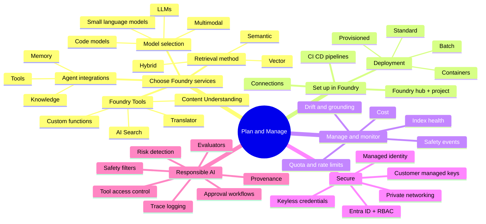
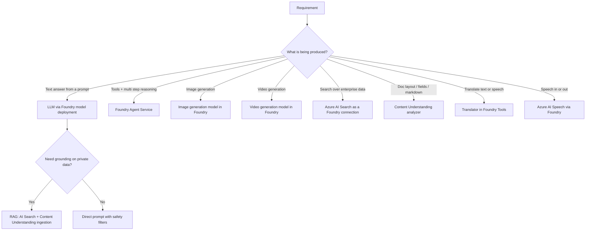
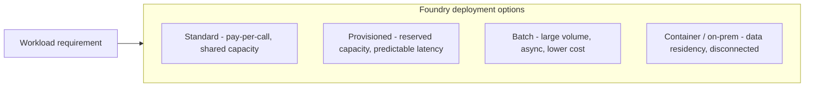
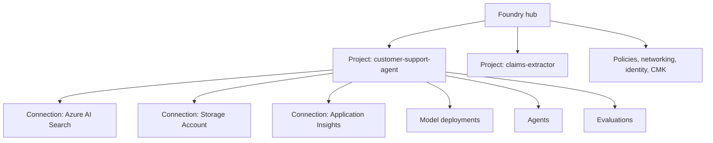
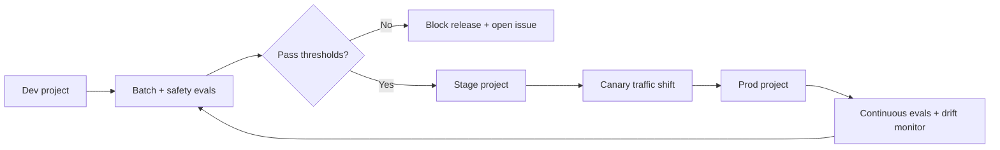
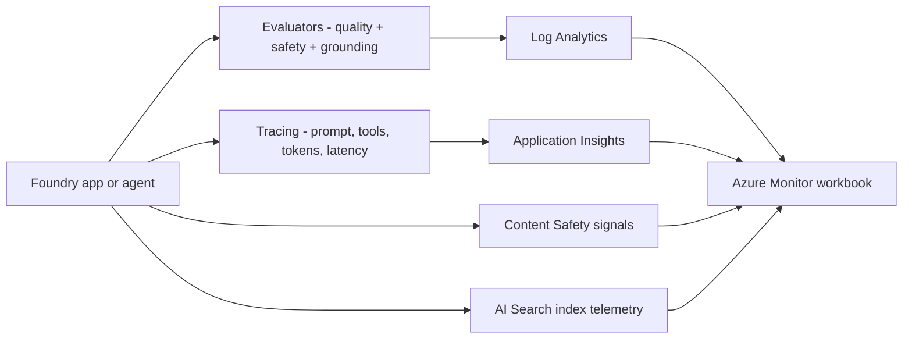
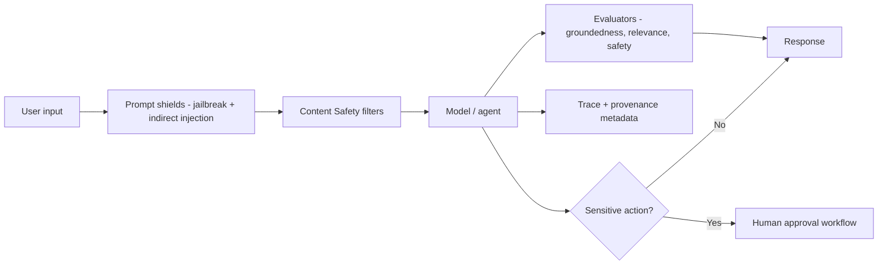

# Domain 1 — Plan and Manage an Azure AI Solution (25–30%)

> The single biggest domain by weight. It is **less about coding** and more about **picking the right Foundry primitive, deploying it correctly, securing it, and governing it**. Most AI-103 wrong-answer traps live here: choosing a standalone service when a Foundry Tool exists, using keys when managed identity is available, or forgetting evaluators / safety filters.

## Mind map

## Choose the right Foundry primitive

### Model selection cheat table

| Need | Pick |
| --- | --- |
| Long-form reasoning, complex tool use | **Large LLM** (frontier reasoning model) |
| High-volume, latency- and cost-sensitive task | **Small language model (SLM)** |
| Image + text input, "look at this and tell me…" | **Multimodal model** |
| Structured code generation / completion | **Code model** |
| Generate an image from a prompt | **Image generation model** |
| Generate a short clip from a prompt or storyboard | **Video generation model** |
| Convert documents into clean grounded markdown | **Content Understanding analyzer** (Foundry Tool) |
| Translate text, with terminology control | **Translator** (Foundry Tool) |
| Find relevant chunks from millions of docs | **Azure AI Search** (Foundry connection) |

> AI-103 trap: if the question mentions **chunks, ranking, embeddings, or "retrieval"**, the right answer is **AI Search**, not a model. If the question mentions **clean markdown, structured fields, layout, OCR + tables**, the right answer is **Content Understanding**, not Document Intelligence prebuilt models alone.

## Foundry deployment options

| Choose | When |
| --- | --- |
| **Standard** | Spiky usage, low or unknown traffic, prototypes |
| **Provisioned (PTU)** | Predictable QPS, strict latency SLOs, regulated workloads |
| **Batch** | Bulk eval, dataset labeling, offline summarization |
| **Containers** | Air-gapped, sovereign cloud, edge, strict residency |

## Set up Foundry — projects, hubs, connections

- **Hub** = shared resource: networking, policy, identity, CMK, default storage and AI Search.
- **Project** = workspace where deployments, connections, agents, evaluations, and traces live.
- **Connections** = how a project reaches data, search, telemetry, and tools without storing keys in code.
- **Connect an app to a project** using the Foundry SDK + a project endpoint — credentials come from `DefaultAzureCredential` / managed identity.

## CI/CD for Foundry projects

- Promote **agent definitions, prompt templates, model deployment names, and evaluation thresholds** as code.
- Treat evaluations as **release gates** (quality, groundedness, safety, latency, cost).
- Use Azure DevOps or GitHub Actions to call the Foundry SDK / CLI; store secrets in **Key Vault** referenced via managed identity.

## Manage quota, scale, rate limits, cost

| Lever | What to watch | Mitigation |
| --- | --- | --- |
| **TPM / RPM quota** | 429s on a deployment | Increase quota, split deployments, route to PTU |
| **PTU utilization** | Underuse vs over-spill | Right-size; spill to standard when above PTU |
| **Token cost** | $/conversation | Smaller model for routing, larger only when needed |
| **Tool latency** | Tail latency | Cache tool results, batch, async fan-out |
| **Index size** | Storage + query cost | Tier old chunks, prune, separate cold index |
| **Agent loop length** | Runaway tool calls | Step limit, budget guard, deterministic tool router |

## Monitor — quality, drift, safety, grounding

Track: **groundedness, relevance, fluency, fabrication rate, safety blocks, latency P95, tokens in/out, tool error rate, index freshness**.

## Secure AI systems

| Control | Default answer on AI-103 |
| --- | --- |
| Authentication to Foundry | **Microsoft Entra ID + managed identity** (keyless) |
| Connection from app → Foundry project | **`DefaultAzureCredential` + project endpoint** |
| Connection from project → AI Search / Storage | **System-assigned managed identity + RBAC role** |
| Network exposure | **Private endpoints + disable public network access** |
| Secret storage | **Key Vault references**, never inline keys |
| Data at rest | **Customer-managed keys (CMK)** for regulated workloads |
| Tool access from agent | **Tool allowlist + per-tool RBAC + approval policy** |

> Trap: if a question shows an API key in the answer choices and another option uses managed identity, the managed identity option is almost always correct on AI-103.

## Responsible AI across generative + agentic systems

Required building blocks:

- **Safety filters** — Content Safety categories (hate, violence, sexual, self-harm) + severity thresholds.
- **Prompt shields** — block direct **jailbreaks** and **indirect prompt injection** (especially text embedded in images / docs).
- **Risk detection** — protected-material, groundedness, blocklists, custom policies.
- **Evaluators** — built-in (groundedness, relevance, fluency, coherence, safety) + custom.
- **Trace logging + provenance** — every tool call, retrieved chunk, citation, and decision recorded.
- **Approval workflows** — human-in-the-loop on destructive or external actions.
- **Tool-access control + oversight modes** — `ask`, `auto`, `deny`; allowlist of MCP / function tools.

## Domain summary

- **Foundry-first vocabulary** — projects, connections, Foundry Tools, Agent Service.
- **Keyless by default** — managed identity, Entra ID, Key Vault.
- **Right-size deployment** — Standard for spiky, PTU for predictable, Batch for volume, Containers for sovereign.
- **Treat evals + safety as gates**, not optional add-ons.
- **Observe everything** — tracing, evaluators, drift, index health, cost.
