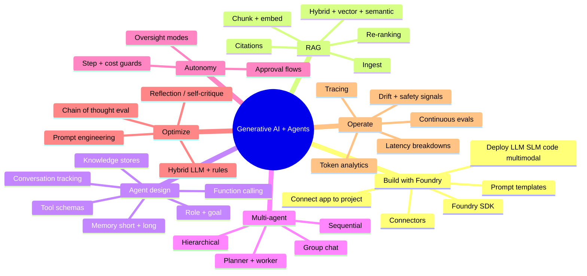
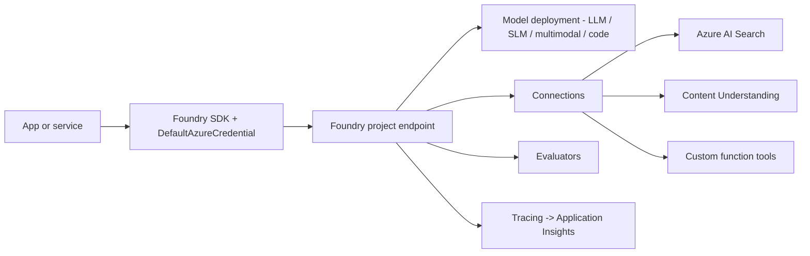
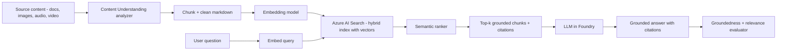
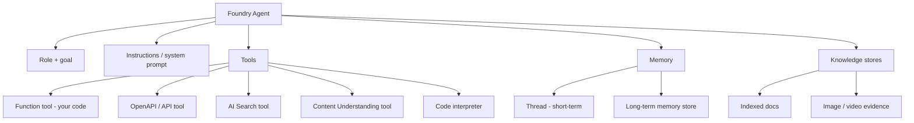
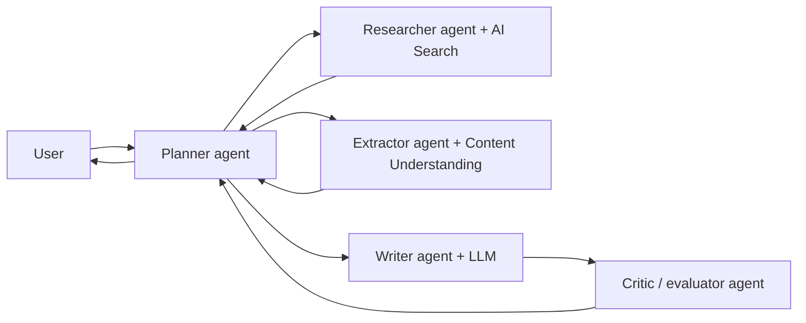
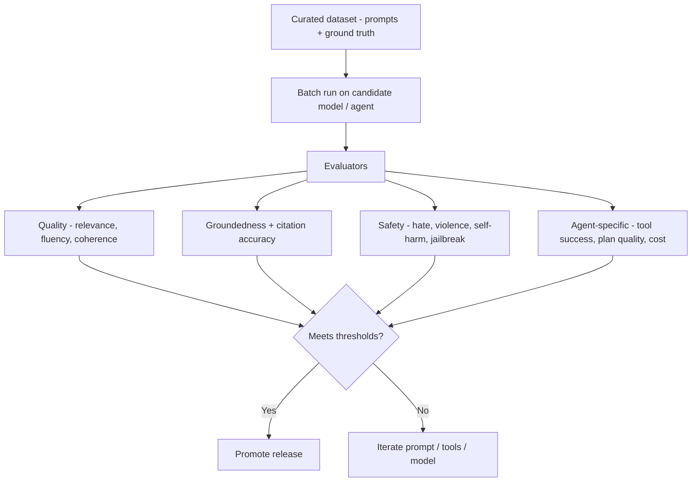
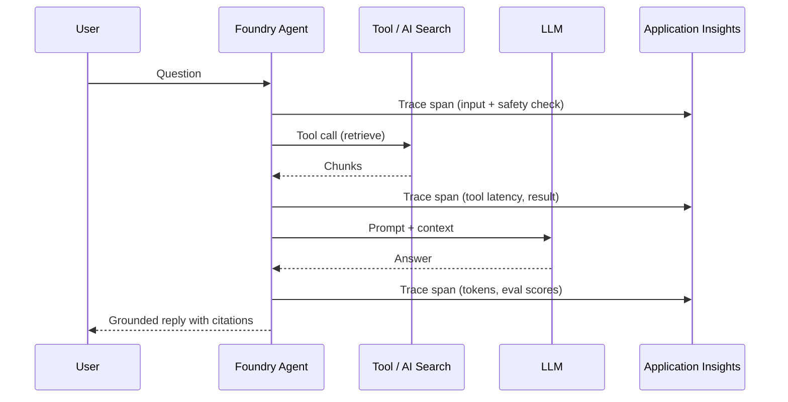

# Domain 2 — Implement Generative AI and Agentic Solutions (30–35%)

> The **heaviest domain**. AI-102 split this into two; AI-103 fuses them. Expect deep questions on **Foundry SDKs**, **RAG**, **agent design (roles, tools, memory)**, **multi-agent orchestration**, **evaluators**, **tracing**, **prompt engineering**, and **operationalization**.

## Mind map

## Build generative apps with Foundry

Mental model:

1. **Configure project** in Microsoft Foundry — model deployments, connections, tools, evaluations.
2. **Connect app** with Foundry SDK using project endpoint + managed identity.
3. **Compose pipelines** — prompt templates, tool calls, RAG, evaluators.
4. **Deploy** the app behind App Service / Container Apps / Functions.
5. **Observe** with tracing + continuous evals.

## Retrieval-Augmented Generation (RAG)

| Choice | Use when |
| --- | --- |
| **Vector search** | Pure semantic similarity, no keyword overlap |
| **Hybrid search (BM25 + vector)** | Default for enterprise RAG — best recall |
| **Semantic ranker** | Re-rank top results for precision and captions |
| **Integrated vectorization** | Push embedding into the indexer pipeline |

> Trap: "We need higher-quality answers from a search index" → **enable semantic ranker on a hybrid index**, not "switch to a bigger model".

### Detect fabrications

- Use the **groundedness evaluator** in Foundry.
- Require **citations** in the system prompt, then validate every claim points at a retrieved chunk.
- Add a **self-critique** pass: "Did every sentence cite a source? If not, rewrite or refuse."

## Build agents with Foundry Agent Service

Required design choices for any agent:

| Decision | Notes |
| --- | --- |
| **Role + goal** | Clear scope; refuse out-of-scope tasks |
| **Conversation tracking** | Threads + persisted state per user / session |
| **Tool schemas** | Strict JSON schema; minimum required fields |
| **Function calling** | Validate args, idempotency, retry logic |
| **Memory** | Short = thread; long = vector store keyed by user / org |
| **Knowledge** | Connect via AI Search or Content Understanding tool |
| **Safety** | Filters + prompt shields + tool allowlist + approval |
| **Tracing** | Every tool call captured for replay + audit |

## Multi-agent orchestration

Patterns to recognize:

- **Sequential pipeline** — fixed order of specialists.
- **Planner + workers** — a planner decides which worker runs next.
- **Hierarchical** — manager agents delegate to sub-agents.
- **Group chat** — multiple agents debate; a moderator picks the answer.
- **Critic loop** — generator + critic improves output until thresholds pass.

> Trap: when a question shows multiple narrow specialists feeding one coordinator, the answer is **multi-agent orchestration**, not "make one bigger prompt".

## Autonomy + safeguards

| Mode | When | Guardrail |
| --- | --- | --- |
| **Manual / ask** | Any destructive or external action | Per-step user approval |
| **Auto with approval gates** | Most production agents | Approve specific tool classes (send email, write to system of record) |
| **Auto** | Internal, idempotent reads | Step + token + cost budget |
| **Autonomous** | Background workflows | Time-boxed, dead-letter on failure, full trace |

Hard limits to set on every agent: **max steps**, **max tool retries**, **max wall-clock**, **max tokens**, **max $ per session**, **tool allowlist**, **destructive-action allowlist**.

## Evaluation

- **Built-in evaluators**: groundedness, relevance, similarity, fluency, coherence, safety, protected-material.
- **Agent evaluators**: tool-call success, plan quality, intent resolution, conversation completeness.
- **Custom evaluators**: domain rules, regex, policy, judge LLM.
- **Continuous evaluation**: schedule the same evaluators on production traces.

## Optimize and operationalize

| Technique | Use it for |
| --- | --- |
| **Prompt engineering** | System prompt patterns: persona, format, examples, refusals |
| **Few-shot examples** | Lift accuracy without fine-tuning |
| **Model parameters** | Temperature, top-p, max tokens, seed, response format |
| **Reflection / self-critique** | Reduce fabrications; agent verifies its own answer |
| **Chain-of-thought eval** | Score reasoning quality, not just final answer |
| **Hybrid LLM + rules** | Deterministic guardrails before/after LLM |
| **Model routing** | Cheap SLM for simple intents, big LLM only when needed |
| **Caching** | Embeddings, tool results, common Q&A |

## Tracing + observability

Capture per turn: **tokens in/out, latency, retrieved chunks, tool calls, evaluator scores, safety flags, model + version, project, user / tenant**.

## Domain summary

- **Foundry SDK + project endpoint + managed identity** is the canonical app integration pattern.
- **RAG = hybrid AI Search + Content Understanding ingestion + groundedness evaluator**.
- Every agent answer must reference **role, tools, memory, knowledge, safety, tracing**.
- **Multi-agent** wins when work decomposes into distinct specialists with distinct tools.
- **Autonomy must come with budgets, allowlists, and approvals**.
- **Eval gates ship code**; continuous evals catch drift.
