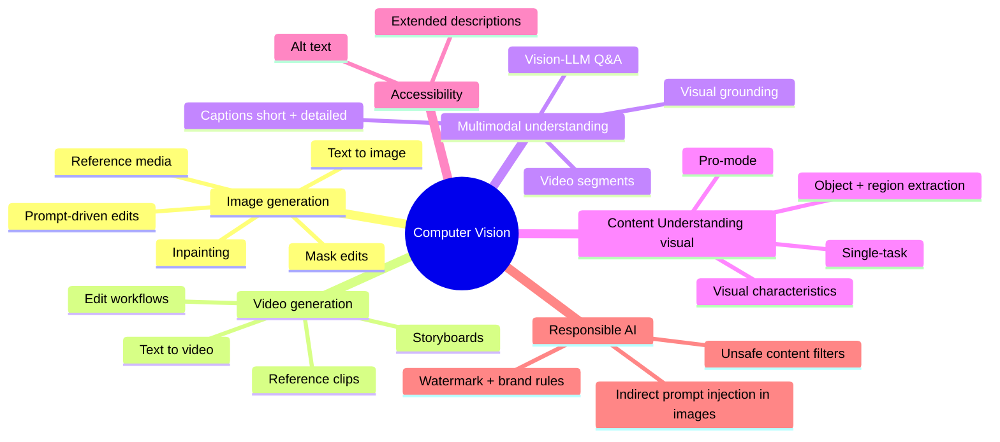
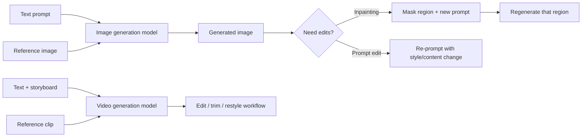
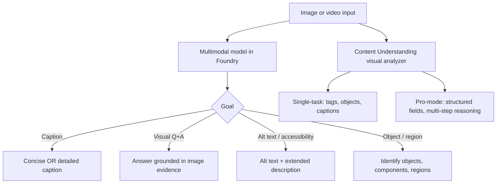
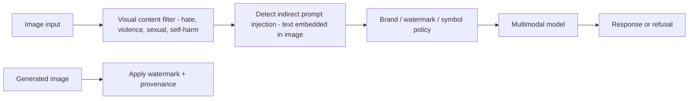
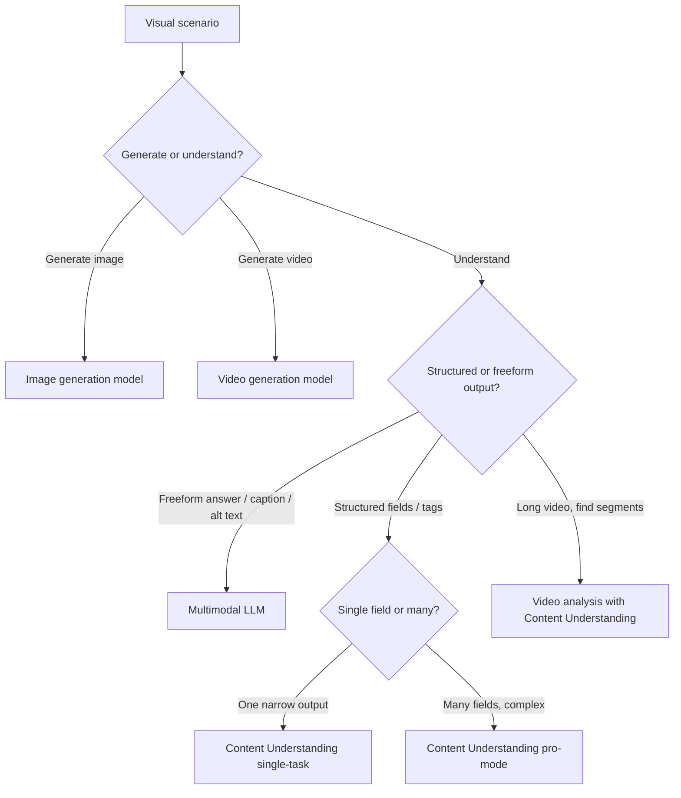

# Domain 3 — Implement Computer Vision Solutions (10–15%)

> Computer vision on AI-103 is **not just analysis**. It now covers **image generation, video generation, multimodal understanding, Content Understanding for visual data, accessibility (alt-text), and visual responsible AI** (indirect prompt injection embedded in images, watermarking, brand policy).

## Mind map

## Image and video generation

| Task | Pick |
| --- | --- |
| Generate marketing image from prompt | **Image generation model** in Foundry |
| Edit only the sky in an existing image | **Inpainting with mask** |
| Replace product color while keeping pose | **Mask-based prompt edit** |
| Generate short clip from script | **Video generation model** |
| Edit a generated clip (trim, restyle, swap subject) | **Video edit workflow on the generated asset** |

> Trap: do not pick "Custom Vision training" for generation. Custom Vision = **classify or detect** in **existing** images. Image **generation** is a separate model class in Foundry.

## Multimodal understanding workflows

| Need | Service | Notes |
| --- | --- | --- |
| Free-form caption / Q&A | **Multimodal LLM** | Best for natural language |
| Structured visual extraction (fields, tags, scores) | **Content Understanding** analyzer | Single-task or pro-mode |
| Long video — find moments, segments, scenes | **Video analysis pipeline** with Content Understanding | Per-segment outputs |
| Accessible alt-text + extended description | **Multimodal LLM with accessibility prompt** | Aligned to WCAG-style guidance |
| Detect specific products / parts in images | **Object / region extraction** via Content Understanding or vision-LLM grounding |

## Content Understanding — single-task vs pro-mode

| Mode | Use it when |
| --- | --- |
| **Single-task** | One narrow output (e.g., "extract make/model"); fast, cheap, low complexity |
| **Pro-mode** | Multi-step reasoning, multi-field extraction, complex layouts, mixed modalities; richer structured output |

> Trap: "Extract a single tag from each image at high volume" → **single-task**. "Extract structured JSON with 12 fields and visual reasoning" → **pro-mode**.

## Visual responsible AI

Required controls on AI-103:

- **Visual content filters** classify and block unsafe imagery.
- **Indirect prompt injection** — text inside an image that tries to override the system prompt is detected and stripped.
- **Visual policy enforcement** — watermarking, brand-asset rules, prohibited symbols, "potentially inappropriate" flagging.
- **Provenance metadata** on generated assets (who / what model / when).

## Service decision flow

## Domain summary

- **Generation** (image/video) and **understanding** (multimodal) are separate model classes.
- **Inpainting + mask edits** are the canonical answer for "change only this region".
- **Content Understanding** owns structured visual extraction; pick **single-task** vs **pro-mode** by complexity.
- **Multimodal LLMs** own free-form captions, Q&A, alt-text, and visual grounding.
- **Visual safety** = unsafe-content filters **plus** indirect-prompt-injection detection **plus** brand / watermark policy.
