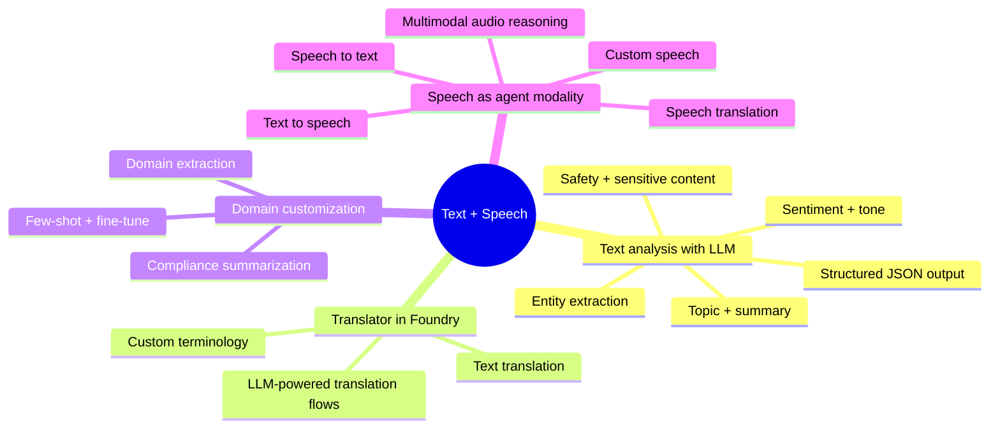
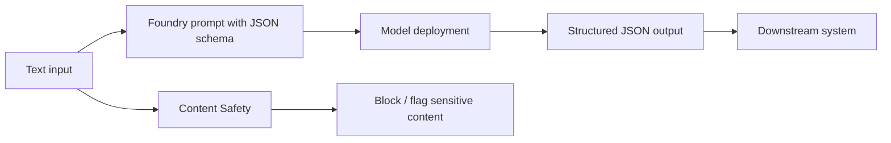
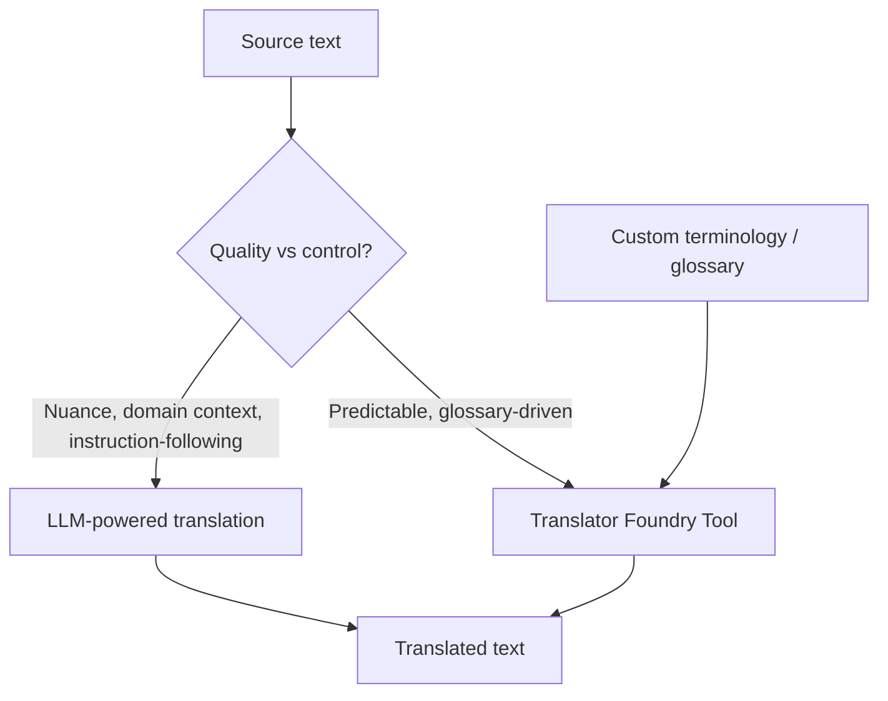
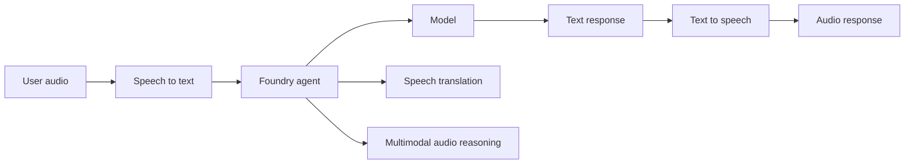
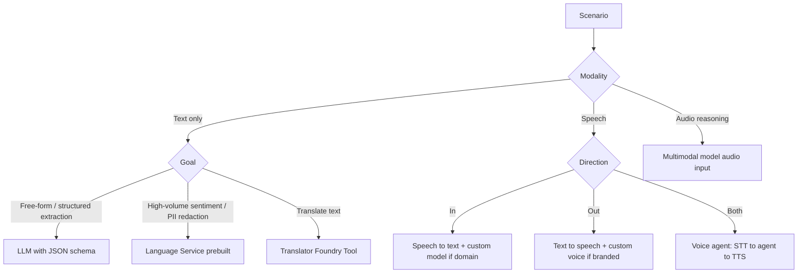

# Domain 4 — Implement Text Analysis + Speech Solutions (10–15%)

> AI-103 reframes "NLP" as **LLM-powered text analysis through Foundry Tools** and **speech as an agent modality**. The classic Language service tasks are still relevant, but the expected default is **prompt the LLM with structured output** unless a question explicitly calls out a prebuilt feature.

## Mind map

## LLM-driven text analysis with Foundry Tools

| Need | Approach |
| --- | --- |
| Extract entities (people, orgs, dates, custom types) | **LLM with JSON-schema response format** |
| Topic clustering / themes | **LLM summarization + topic prompt**, optionally embeddings |
| Abstractive summary | **LLM summarization Foundry Tool** |
| Sentiment + tone (positive/negative/neutral + nuance) | **LLM prompt** or **Language sentiment** for high-volume cheap calls |
| Safety / sensitive content classification | **Azure AI Content Safety** + custom blocklists |

> Trap: when the wording asks for "structured JSON, custom fields, multi-document at once" → the LLM with **schema-constrained output** wins. When it asks for "millions of tweets, lowest cost, fixed sentiment polarity" → the **Language sentiment** prebuilt feature is fine.

## Translator in Foundry

- **Translator Foundry Tool** — robust, supports **custom terminology**, document translation, and language detection.
- **LLM-powered translation flows** — better when the task includes **style, register, contextual rewriting, multilingual reasoning**.
- For agents: expose Translator as a **tool** so the agent can decide when to translate.

## Customize for domain tasks

| Goal | Technique |
| --- | --- |
| Compliance summary with mandatory sections | **Prompt template** with strict format + few-shot exemplars |
| Industry vocabulary recognition | **Custom terminology** in Translator + few-shot in prompts |
| Reproducible domain extraction | **JSON schema** + groundedness eval |
| Edge cases at scale | **Fine-tuning** when prompt engineering plateaus |
| Repeatable behavior across teams | **Foundry prompt templates + versioned in CI/CD** |

## Speech as an agent modality

| Need | Service / pattern |
| --- | --- |
| Voice in / voice out agent | **STT → agent → TTS** pipeline through Foundry |
| Domain-specific accuracy | **Custom speech model** for STT |
| Branded voice | **Custom neural voice** for TTS (with approval) |
| Reasoning over an audio clip (e.g., classify a meeting) | **Multimodal model that accepts audio** |
| Live-translated calls | **Speech translation** via Foundry Tool / SDK |

### Latency design for voice agents

- Use **streaming STT** and **streaming TTS** — never wait for full transcript.
- Pick a **small fast model** for routing intents and a **larger model** only when necessary.
- Pre-warm tools and connections; cache embeddings.
- Set a **hard end-of-turn detector** to avoid runaway listening.

## Decision flow — text and speech

## Responsible AI for text + speech

- **PII redaction** before the prompt reaches the model.
- **Content Safety** filters on both inputs and outputs.
- **Prompt shields** to block jailbreaks even when delivered via voice.
- **Provenance** on TTS-generated audio when used externally.
- **Consent and disclosure** when using custom voice or speech translation in calls.

## Domain summary

- The default text-analysis answer on AI-103 is **LLM with structured output through Foundry Tools**, not a prebuilt task — unless cost/scale clearly demands it.
- **Translator** stays the answer for glossary-driven, deterministic translation; LLM flows handle nuance.
- **Speech is an agent modality**: STT → agent → TTS, with **custom speech** and **custom voice** as the customization knobs.
- Multimodal audio models replace "send audio file → get transcript → reason" pipelines when the question asks for **direct reasoning over the audio**.
