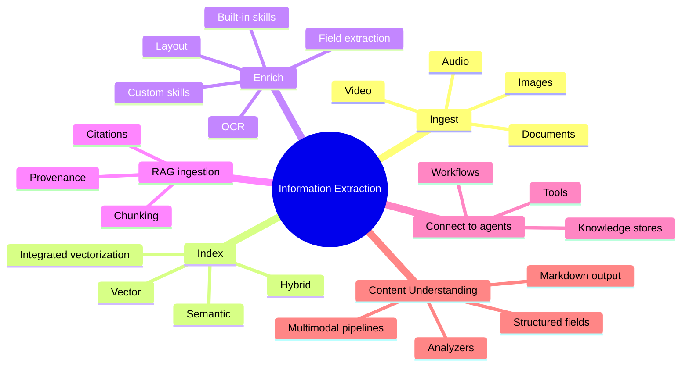
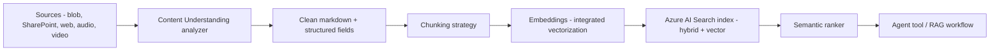
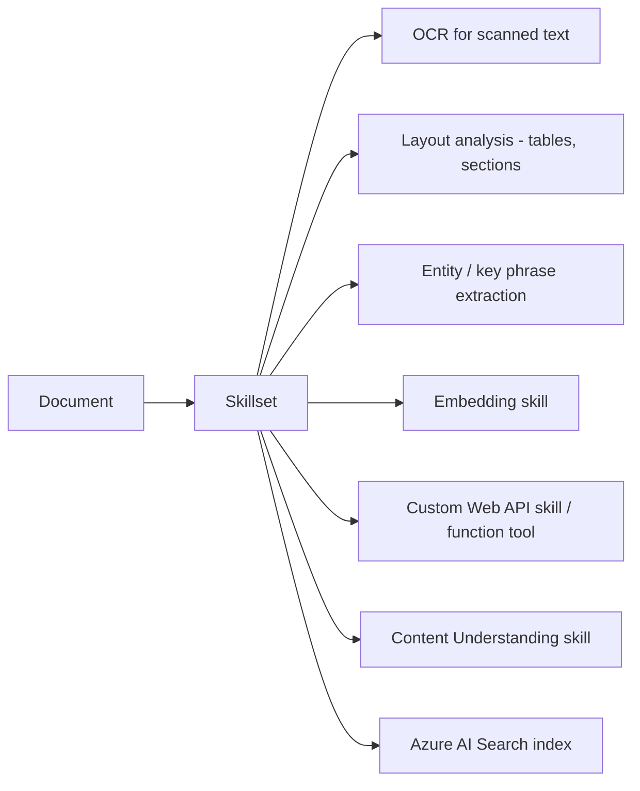
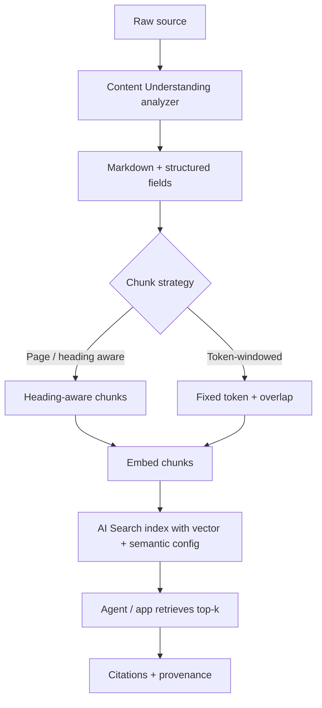
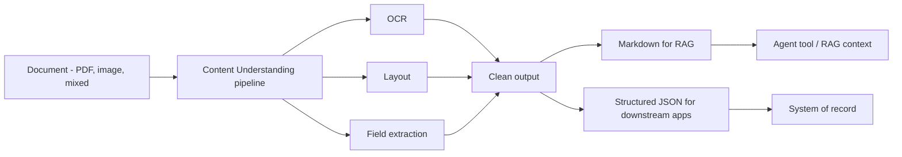
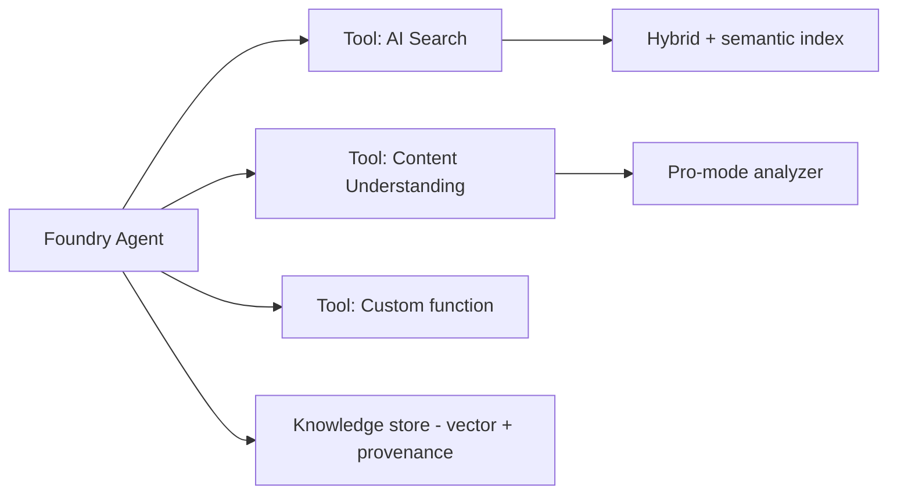
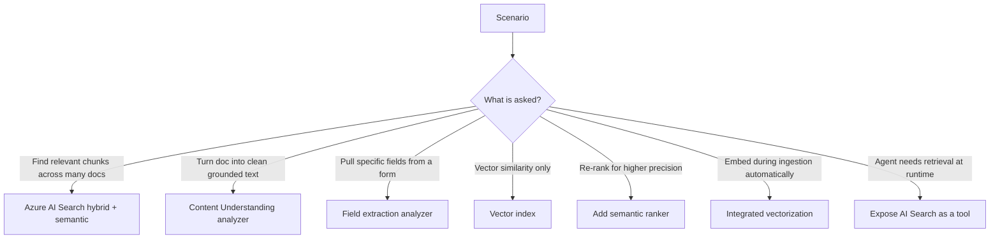

# Domain 5 — Implement Information Extraction Solutions (10–15%)

> The AI-103 evolution of "knowledge mining" + "Document Intelligence". The headline tools are now **Azure AI Search** for retrieval and **Content Understanding** for ingestion-grade extraction. This domain is about **building the grounding pipeline** that powers RAG and agents.

## Mind map

## Build retrieval and grounding pipelines

### Search modes — pick consciously

| Mode | When | Notes |
| --- | --- | --- |
| **Keyword (BM25)** | Exact strings, IDs, codes | Cheap, deterministic |
| **Vector** | Semantic similarity, paraphrasing | Needs embedding model + vector field |
| **Hybrid** | Default for enterprise RAG | Best recall in practice |
| **Semantic ranker** | Re-rank top-N for precision + captions + answers | Quality lift on top of hybrid |
| **Integrated vectorization** | You want indexer to embed + chunk | Push-button RAG ingestion |

> Trap: "Improve answer quality without retraining" → **enable hybrid + semantic ranker** before suggesting a bigger model.

## Enrichment skills

| Skill | Use it for |
| --- | --- |
| **OCR** | Image-only PDFs, scans, photos of documents |
| **Layout** | Tables, sections, reading order, page-aware chunks |
| **Field extraction** | Pull invoice / contract / form fields |
| **Embedding skill** | Vectorize chunks during indexing |
| **Custom skill** | Bespoke logic via Azure Function / API |
| **Content Understanding skill** | Multimodal extraction → markdown + JSON |

## Configure RAG ingestion

Checklist for a production RAG ingestion:

- **One analyzer per content type** (contracts, invoices, slides, screenshots, audio, video).
- **Heading-aware chunks** beat fixed windows for prose; **layout-aware** for tables.
- **Vector field + semantic configuration** on the index; **hybrid query** at retrieval time.
- **Citations** = chunk IDs + source URI + page / segment.
- **Re-index on change** (push or pull); track **freshness** as a SLO.
- **Access control** — index per tenant, or per-document security trimming via filter.

## Extract content from documents

| Output | Use it for |
| --- | --- |
| **Markdown** | Drop into prompts and RAG; preserves structure for the LLM |
| **Structured JSON / fields** | Update business systems, validate, audit |
| **Pro-mode analyzers** | Multi-step reasoning over complex layouts |

## Connect retrieval directly to agents

Patterns:

- Expose **AI Search** as an agent tool so the agent can pick query type (keyword, vector, hybrid).
- Expose **Content Understanding analyzers** as tools for on-demand structured extraction.
- Persist **knowledge stores** for long-term agent memory (vector + metadata + ACL).

## Decision flow

## Domain summary

- **Content Understanding ingests; AI Search retrieves.** Memorize this split.
- **Hybrid + semantic ranker** is the safe default for RAG quality questions.
- **Integrated vectorization** is the answer when the question says "automatically embed during indexing".
- **Pro-mode analyzers** handle complex multi-step extraction; **single-task** for simple narrow output.
- Always think **chunk strategy + citations + provenance + freshness** when designing ingestion.
