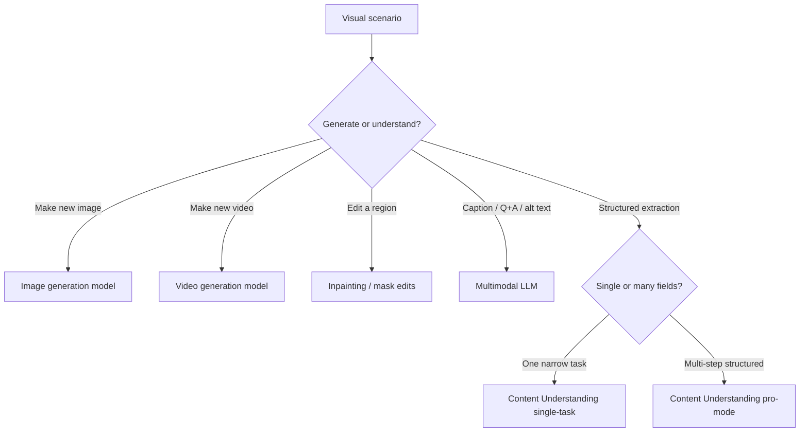
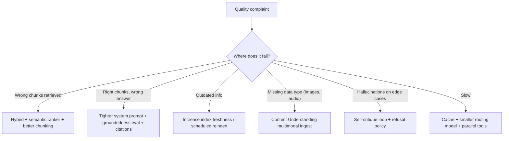
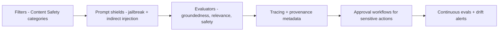
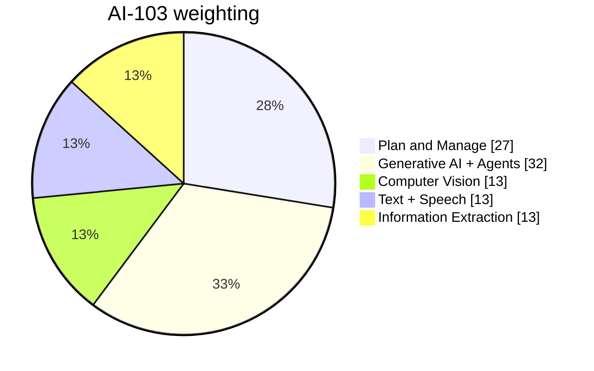

# Exam Decision Reference

> One-stop scenario → service map for AI-103. Pair with the [Master Index](00-MASTER-INDEX.md). Use this to drill recognition speed.

## Service-fit matrix

| Scenario clue | Pick | Why |
| --- | --- | --- |
| "Build an agent with tools, memory, and tracing on Foundry" | **Foundry Agent Service** | Native agent primitive |
| "Connect my Python app to a Foundry project" | **Foundry SDK + project endpoint + DefaultAzureCredential** | Keyless integration |
| "Improve answer quality from a search index" | **Hybrid query + semantic ranker** on AI Search | Quality lift before bigger model |
| "Embed automatically during indexing" | **Integrated vectorization** in AI Search | Built-in chunk + embed |
| "Extract clean markdown + fields from PDFs / scans" | **Content Understanding analyzer** | Multimodal grounded output |
| "Generate an image from a prompt" | **Image generation model** in Foundry | Generation, not Custom Vision |
| "Edit only the sky in this photo" | **Inpainting with mask** | Region-targeted edit |
| "Generate a short video from a script" | **Video generation model** | Native video gen |
| "Caption images for accessibility" | **Multimodal LLM with alt-text prompt** | Free-form, accessibility-aware |
| "Detect text inside images that tries to override the prompt" | **Indirect prompt-injection detection** | Prompt shields for vision |
| "Translate text with a corporate glossary" | **Translator Foundry Tool** with custom terminology | Deterministic with glossary |
| "Translate with style/tone awareness" | **LLM-powered translation flow** | Nuance > rules |
| "Voice-in / voice-out customer agent" | **STT → Foundry agent → TTS** | Streaming pipeline |
| "Brand-specific voice for an IVR" | **Custom neural voice** (TTS) | Branded audio |
| "Domain-specific transcription accuracy" | **Custom speech model** (STT) | Acoustic + lexicon adaptation |
| "Reason directly over an audio recording" | **Multimodal model with audio input** | Skip transcript step |
| "Detect drift in a deployed agent" | **Continuous evaluations** + tracing | Production observability |
| "Block jailbreak attempts" | **Prompt shields** + Content Safety | Defense layer 1 |
| "Stop fabrications" | **Groundedness evaluator + RAG with citations + self-critique** | Layered fix |
| "Stop runaway agent loops" | **Step + token + cost budgets**, tool allowlist, approval gates | Autonomy guardrails |
| "Predictable latency for a chat product" | **Provisioned (PTU) deployment** | Reserved capacity |
| "Massive offline summarization job" | **Batch deployment** | Lower cost, async |
| "Sovereign cloud / on-prem inference" | **Container deployment** | Data residency |
| "Avoid storing keys" | **Managed identity + Entra ID + Key Vault references** | Keyless default |
| "Block public access" | **Private endpoints + disable public network access** | Network isolation |

## Generation vs understanding

## RAG quality decision tree

## Agent design checklist

| Layer | Must define |
| --- | --- |
| Identity | Role, goal, in-scope vs out-of-scope |
| Memory | Thread (short) + long-term store + privacy boundary |
| Tools | Allowlist, JSON schemas, idempotency, retry, timeouts |
| Knowledge | AI Search connection + Content Understanding analyzer |
| Safety | Prompt shields, Content Safety, blocklists, provenance |
| Autonomy | Step + token + cost budgets, approval mode |
| Observability | Tracing, evaluators, continuous evals, dashboards |
| Lifecycle | Versioning, CI/CD, eval gates, rollback |

## Security cheat sheet

| Question hint | Right answer |
| --- | --- |
| "Without storing API keys" | **Managed identity** |
| "From an internal VNet only" | **Private endpoint + deny public access** |
| "Different team needs read-only access" | **Azure RBAC** built-in role + Entra group |
| "Encrypt with our own keys" | **Customer-managed keys (CMK)** + Key Vault |
| "Audit who used the model" | **Azure Monitor diagnostic settings + Log Analytics** |
| "Limit which tools an agent can call" | **Tool allowlist + per-tool RBAC** |
| "Approve high-risk actions" | **Human-in-the-loop approval workflow** |

## Responsible AI ladder

## Common AI-103 traps

| Trap | What to do |
| --- | --- |
| Picks **API key auth** when **managed identity** is offered | Always prefer keyless |
| Picks **Custom Vision** for image **generation** | Custom Vision = classify/detect existing images, not generate |
| Picks **Document Intelligence prebuilt** when the ask is "clean grounded markdown for RAG" | Use **Content Understanding** |
| Picks **bigger model** to fix retrieval quality | First fix retrieval — hybrid + semantic ranker |
| Picks **Standard deployment** for predictable latency SLOs | Use **Provisioned (PTU)** |
| Picks **single agent** when work decomposes into specialists | Use **multi-agent orchestration** |
| Forgets to **block indirect prompt injection** in images / docs | Add prompt shields and visual injection detection |
| Stores secrets in app settings | **Key Vault references** with managed identity |

## Skill-area weighting reminder

> Treat **Plan and Manage + Generative AI + Agents = ~60%**. If you have limited study time, master those first.
