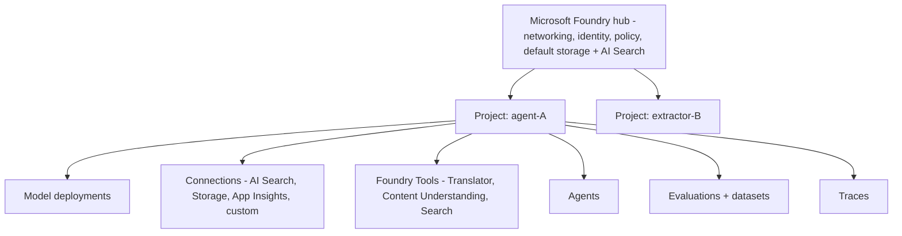
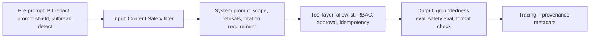

# Advanced Concepts and Decision Patterns

> Supplemental reference covering the Microsoft Foundry architecture model, AI-102 → AI-103 migration notes, and reusable decision frameworks that apply across multiple exam scenarios.

## Microsoft Foundry Architecture Model



Memorize: **hub = shared platform; project = workspace; connections = how the project reaches data and tools; deployments = served models; agents = composed runtime artifacts**.

## AI-102 to AI-103 Transition Reference

- "Generative AI" + "Agentic solutions" merged into one **30–35%** domain.
- "NLP" → **Text analysis** (LLM-first) + **Speech as an agent modality**.
- "Knowledge mining" → **Information extraction** with **Content Understanding** as the headline tool.
- Computer Vision now includes **image and video generation** and **inpainting**.
- **Microsoft Foundry** replaces "Azure AI Studio / Azure AI Foundry" as the named platform.
- **Foundry Tools** is a first-class concept (Translator, AI Search, Content Understanding, custom function).
- **Keyless / managed identity** is the default expected security pattern.
- Responsible AI now explicitly calls out **indirect prompt injection** (text in images / docs) and **provenance metadata**.

## Foundry SDK Programming Model

```python
# Pseudocode pattern repeatedly tested
from foundry import FoundryClient
from azure.identity import DefaultAzureCredential

client = FoundryClient(
    project_endpoint="https://<project>.foundry.azure.com",
    credential=DefaultAzureCredential(),
)

# Models
chat = client.deployments.get_chat("gpt-x")
answer = chat.complete(messages=[...], response_format={"type": "json_schema", ...})

# Agents
agent = client.agents.create(
    name="claims-extractor",
    instructions="...",
    tools=[search_tool, content_understanding_tool, my_function_tool],
    safety={"prompt_shields": True, "filters": "default"},
)
thread = client.agents.threads.create(user_id="u-123")
run = client.agents.runs.create(agent.id, thread.id, message="...")
```

The exam does not ask you to write code, but recognizes:

- The right way to authenticate is **`DefaultAzureCredential`** (managed identity in prod).
- The right place to define an agent is the **project**, not in client code only.
- **Tools are objects with JSON schemas**, not free-text instructions.
- **Threads** carry conversation state.

## Question Keyword Reference

| Words in the question | Likely answer |
| --- | --- |
| "grounded", "citations", "private knowledge" | RAG with **AI Search** + **Content Understanding** |
| "structured JSON output" | **LLM with response schema** |
| "fields from a form / invoice / contract" | **Content Understanding field extraction** |
| "single short tag from each image" | **Content Understanding single-task** |
| "complex multi-field visual reasoning" | **Content Understanding pro-mode** |
| "multi-step reasoning across specialists" | **Multi-agent orchestration** |
| "block prompt that overrides the system" | **Prompt shields** |
| "text inside an image hijacks the model" | **Indirect prompt-injection detection** |
| "policy: must include source links" | **Citation requirement + groundedness evaluator** |
| "predictable QPS, strict SLA" | **Provisioned (PTU)** |
| "spiky, low traffic" | **Standard** |
| "millions of offline docs" | **Batch** |
| "data residency / disconnected" | **Containers** |
| "watermark / brand / detect prohibited symbols on generated images" | **Visual policy enforcement** |
| "agent should ask before doing destructive action" | **Approval workflow / oversight mode** |

## Modernization Patterns from AI-102

| AI-102 instinct | AI-103 default |
| --- | --- |
| Build pipelines in **prompt flow** | Build them in **Foundry projects + SDK + Tools** |
| Reach Azure OpenAI directly with key | Reach **Foundry deployment** via **project endpoint + managed identity** |
| Document Intelligence prebuilt | **Content Understanding analyzers** for grounded output |
| Custom skill in AI Search calling Function | Same, but increasingly the skill calls **Content Understanding** |
| Bot Framework / Composer for chat | **Foundry Agent Service** for agentic chat |
| Container-only inference | **Containers + Foundry deployments** for sovereign workloads |

## Distractor Analysis: Common Incorrect Answers

- **Custom Vision** is wrong whenever the task is **generation** or **multimodal Q&A**.
- **Pure vector search** is wrong when the question wants **answer quality** — add **semantic ranker + hybrid**.
- **Bigger model** is wrong when retrieval quality is the bottleneck.
- **Single agent** is wrong when distinct specialists with distinct tools are needed.
- **API keys** are wrong when managed identity is offered.
- **Public endpoint** is wrong when the question mentions VNet / regulated workload.
- **Document Intelligence prebuilt only** is wrong when the question wants **clean markdown for RAG over mixed content**.
- **Skipping evaluators** is wrong on any "release / promote / production" question.

## Decision Frameworks for Complex Scenarios

### Guardrail Placement Decision Model



### Telemetry Routing Decision Model

- Per-turn details → **Application Insights** (traces).
- Quality / safety scores → **Log Analytics** (Azure Monitor).
- Aggregated dashboards → **Azure Monitor workbooks**.
- Long-term datasets for evaluation → **Foundry datasets** in the project.

### Minimum-Change Remediation Pattern

Always prefer in this order: **prompt change → retrieval change → eval / safety change → model change → architecture change**. AI-103 rewards the smallest change that moves the metric.
