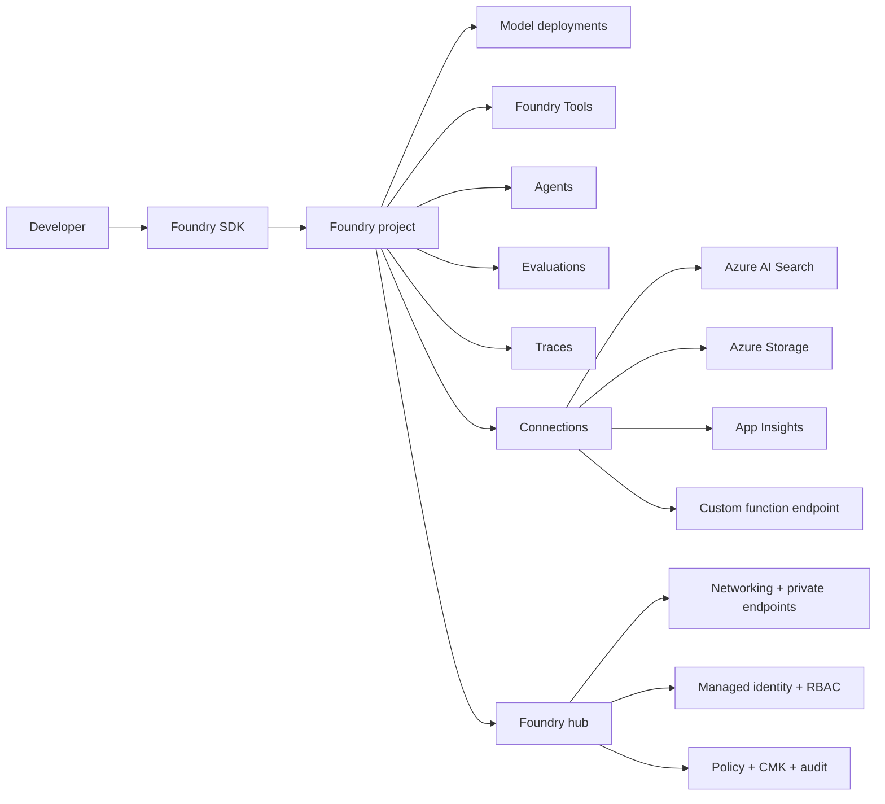
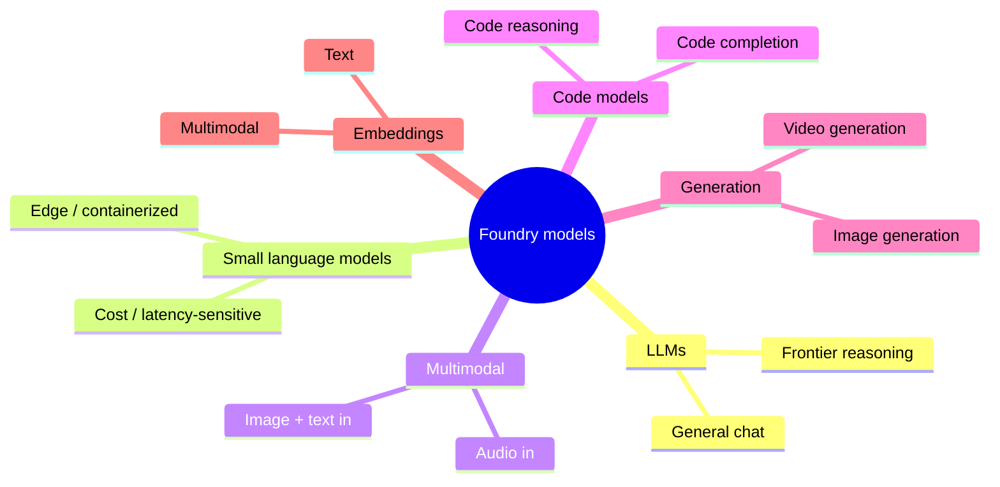
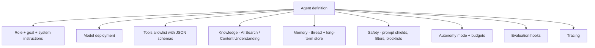
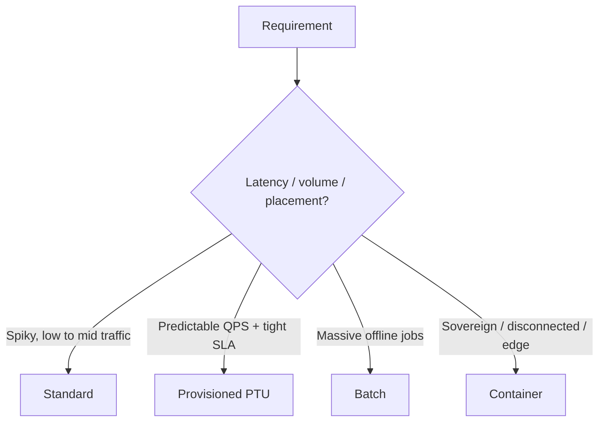
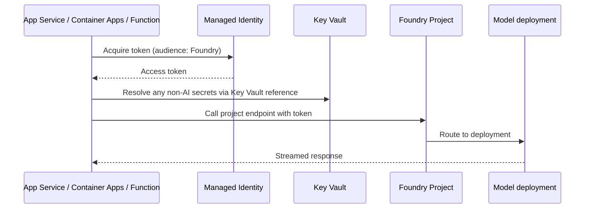
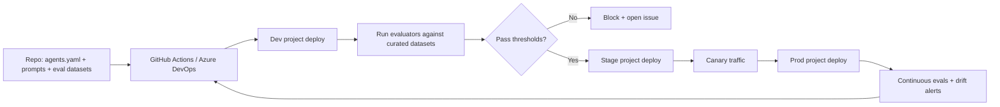

# Microsoft Foundry Deep Dive

> A focused tour of the platform that powers AI-103. If a question feels like it could go many ways, the **Foundry-native primitive** is usually the right answer.

## Why Foundry is the center of AI-103

AI-102 had you stitching Azure OpenAI + AI Search + Bot Framework + prompt flow + Document Intelligence by hand. AI-103 expects you to compose those capabilities **inside a Foundry project**, with **Foundry Tools, connections, agents, evaluations, and tracing** as first-class objects.

## Hubs, projects, connections — what each owns

| Object | Owns |
| --- | --- |
| **Hub** | Networking, default storage + AI Search, identity, policy, customer-managed keys, audit settings |
| **Project** | Model deployments, agents, prompt assets, evaluations, datasets, traces, connections |
| **Connection** | A reusable pointer to an external resource (AI Search index, storage container, App Insights, MCP / custom tool endpoint) — credentials managed by Foundry, not in code |

## Foundry Tools — the first-class building blocks

| Tool | Purpose | Comes back as |
| --- | --- | --- |
| **AI Search** | Retrieval against an indexed knowledge base | Top-k chunks with citations |
| **Content Understanding** | Multimodal extraction → markdown / structured fields | Grounded text + JSON |
| **Translator** | Glossary-driven translation, language detection | Translated text |
| **Code interpreter** | Run code on uploaded files | Result + generated artifacts |
| **Custom function tool** | Your own API or Azure Function | Whatever your tool returns |
| **OpenAPI / API tool** | Wrap an existing REST API | Structured response |

> Trap: when a scenario maps to a Foundry Tool, picking a "raw" service call instead is usually the wrong AI-103 answer. The exam wants composition through the platform.

## Model classes in the Foundry catalog

## Foundry Agent Service — anatomy

Lifecycle:

1. **Define** the agent in a project (versioned).
2. **Test** with curated datasets via batch evaluations.
3. **Promote** through environments using CI/CD with eval gates.
4. **Monitor** with continuous evals + tracing in production.
5. **Iterate** — most regressions are fixed at the **prompt / tool / retrieval** layer before touching the model.

## Deployment options — when to pick what

| Lever | Standard | Provisioned (PTU) | Batch | Containers |
| --- | --- | --- | --- | --- |
| Capacity | Shared | Reserved | Async pool | Yours |
| Latency | Variable | Predictable | Hours | Local |
| Cost model | Per token | Reserved units | Lower per token | Infra cost |
| Use it for | Prototypes, spiky apps | Production chat / agents | Eval, summarization | Sovereign / disconnected |

## Connecting an app safely

Required posture for AI-103-style answers:

- **Managed identity** on the host (App Service, Container Apps, Function, AKS pod).
- **RBAC role** assigned on the Foundry project / hub.
- **`DefaultAzureCredential`** in code; no keys in config.
- **Private endpoint** + **disable public network access** for regulated workloads.
- **Customer-managed keys** when sovereignty / compliance requires it.

## Per-service "what shows up where in Foundry"

| Service | Foundry surface |
| --- | --- |
| Azure OpenAI models | Model catalog → deployments in a project |
| Azure AI Search | Connection → exposed as **AI Search Foundry Tool** |
| Content Understanding | Connection / built-in → **analyzers** as a Foundry Tool |
| Translator | Foundry Tool |
| Speech | SDK + Foundry connection for agent voice modality |
| Document Intelligence | Used inside a Content Understanding analyzer or a custom skill |
| Application Insights | Connection target for tracing |
| Storage | Connection for datasets, files, knowledge stores |

## Foundry CI/CD reference flow

## Foundry deep-dive takeaways

- **Default to the Foundry-native primitive.**
- **Default to keyless auth and private networking.**
- **Default to evaluators as release gates.**
- **Default to multi-agent + tools + memory** when work decomposes.
- **Default to Content Understanding + AI Search** for grounding.
- **Default to tracing + continuous evals** for production.

If you internalize those defaults, most AI-103 wrong answers eliminate themselves.
